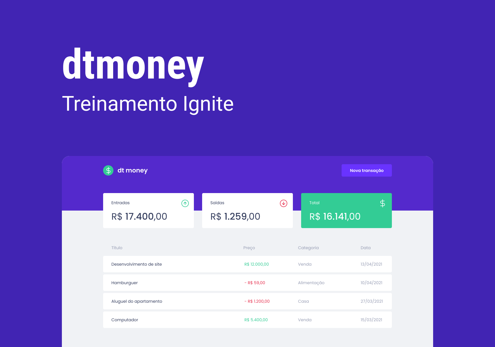

## Sobre o Projeto

Este projeto desenvolvido durante o Capítuo II da trilha de React JS do Rocketseat Ignite. Ele consiste em uma dashboard onde é possivel cadastrar e ver transações feitas.

## Links Úteis

### Layout

O layout dessa aplicação está disponível em [https://www.figma.com/file/UDRxVOIhzHuH01v1MB8Onu/dtmoney-Ignite?node-id=0%3A1](https://www.figma.com/file/UDRxVOIhzHuH01v1MB8Onu/dtmoney-Ignite?node-id=0%3A1)

### Versão de Produção

Disponível em [https://dtmoney-vinebarbosa.vercel.app](https://dtmoney-vinebarbosa.vercel.app/)

## Conhecimentos adquiridos

- Styled Componentes
- React Modal
- Polished
- Miraje JS
- Criação de estilos globais
- Carregamento de fontes do Google Fonts
- Criação de contextos e hooks

 
Made with love by Vine
